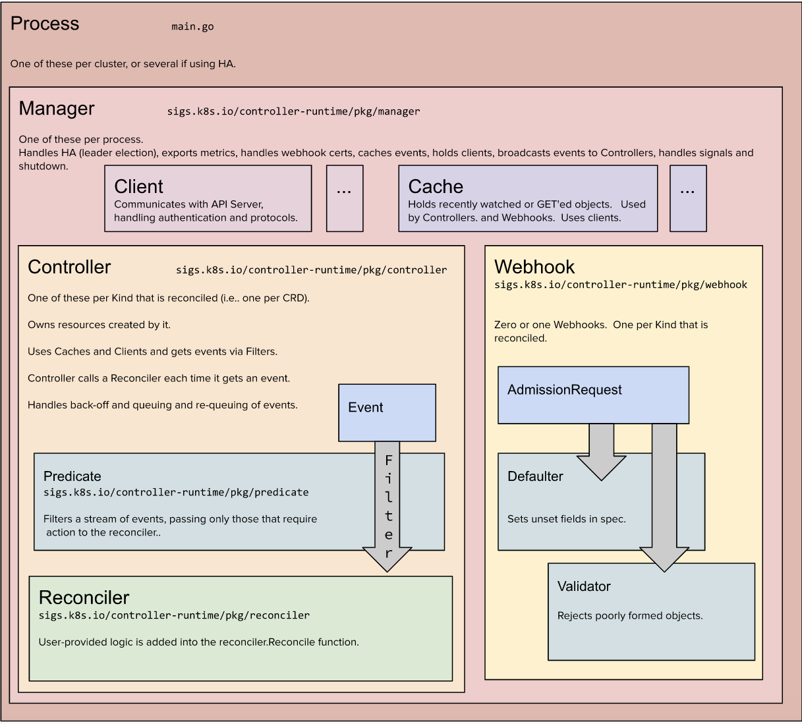

# Controller architecture based on kubebuilder framework

# Key conepts around Kubernetes APIs

GVK : GroupVersionKind (Corresponds to a given root Go type in package)
GVR ; GroupVersionResource

Scheme provides mapping between kinds and their corresponding Go types.

API forward/backward compatibility :  A kind may change forms between versions. Each form must be able to store all the data of the other forms, somehow (we can store the data in fields, or in annotations)

Key design consideration while designing CRD :

1. Single responsibility ::

Ex- Designing CRD for webapp with classic architecture - an application and database. We can do it using two CRDs. One for the application and the other one for the DB. By having such two CRD approach, all the established concepts like encapsulation, the single responsibility principle, and cohesion will be well respected without causing any undesirable side effects, such as difficulty in extending, reuse, or maintenance, just to name a few.

We can create the APP CRD which will have its CONTROLLER which can have responsibility like creating Deployment that contained the APP and creating Services to access it … Similarly, we could create a CRD to represent the DB, and deploy a controller that would manage DB instances.

All Kind must implement a runtime.Object ( https://pkg.go.dev/k8s.io/apimachinery/pkg/runtime#Object ) interface.

# Build & install Operator, namely CronJob using KubeBuilder

## Scaffold out a new project

kubebuilder init --domain tutorial.kubebuilder.io    # Configure the API group suffix

## Scaffold a new API by specifying its GVK (Group-Version-Kind)

kubebuilder create api --group batch --version v1 --kind CronJob   # custom Resource Defination and the Controller

### Review the generated YAMLs (Open API) : note the the generated « Resource requirement (for compute resources) » and the « defaulting »
### Adapt the metadata/spec/status of the type CronJob in the file api/v1/cronjob_types.go
### Attention !!  You may have to adpat the kubebuilder marker as well

## tidy go the imports

go mod tidy

## Run locally

make install
make run ENABLE_WEBHOOKS=false

## Run on the cluster

make docker-build docker-push IMG=<some-registry>/<project-name>:tag
make docker-build docker-push IMG=artifactory.toto.io/docker-internal/kube-operators/kubebuilder-cronjob:latest

Kustomize build # View the resulting Objects before deploying on the cluster

make deploy IMG=artifactory.toto.io/docker-internal/kube-operators/kubebuilder-cronjob:latest

kubectl create -f config/samples/batch_v1_cronjob.yaml    # Create a CronJob resource

##Useful links to understand the code of this tutorial ::

https://kubebuilder.io/  
https://github.com/kubernetes-sigs/kubebuilder/tree/master/docs/book/src/cronjob-tutorial/testdata/project  
https://github.com/kubernetes-sigs/kustomize  
https://pkg.go.dev/sigs.k8s.io/controller-runtime  
What is scheme :: https://pkg.go.dev/k8s.io/apimachinery/pkg/runtime#Scheme  
RBAC in k8s :: https://kubernetes.io/docs/reference/access-authn-authz/rbac/  
K8s API guide line :: https://github.com/kubernetes/community/blob/master/contributors/devel/sig-architecture/api-conventions.md  
Logging API : https://github.com/go-logr/logr  
Admission hook for CRD : https://kubebuilder.io/reference/admission-webhook.html  
Request Object : https://pkg.go.dev/sigs.k8s.io/controller-runtime/pkg/reconcile#Request  
NameSpacedName : https://pkg.go.dev/sigs.k8s.io/controller-runtime/pkg/client#ObjectKey  