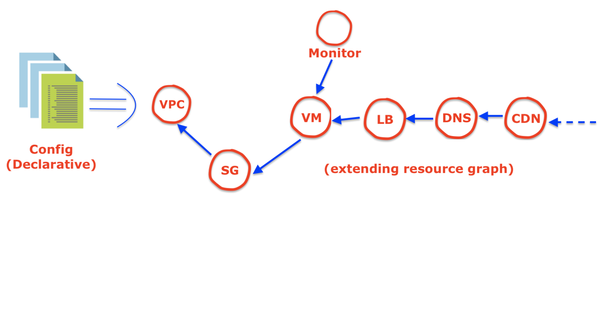

## What is infrastructure as code (IaC)
Infrastructure as Code (IaC) is the management of infrastructure (networks, virtual machines, load balancers, and connection
topology) in a descriptive model, using the same versioning as DevOps team uses for source code. Like the principle that
the same source code generates the same binary, an IaC model generates the same environment every time it is applied.

IaC solves the problem of environment drift occurs due to the snowflake effect.

Infrastructure as Code follows the principle of Idempotence. Due to this property a deployment command always sets the 
target environment into the same configuration, regardless of the environment's starting state. Idempotency is achieved 
by either automatically configuring an existing target or by discarding the existing target and recreating a fresh 
environment.

Typically, IaC follows well-documented code formats such as JSON, Yaml etc.