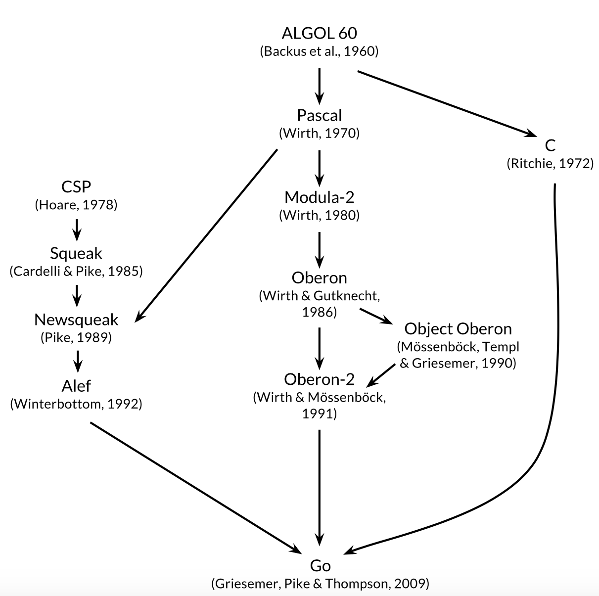

Go is a "C-like language" or "C for the 21st century" 

GO genealogy ::  




Go, inherits C & Pascal.  

From, C, Go inherited, its expression syntax, control-flow statements, basic data types, 
call-by-value parameter passing, pointers, and compilation for efficient machine code that 
cooperate naturally with the abstractions of current operating systems. Go also support, 
Communicating Sequential Process (CSP), a program is a parallel composition of processes that 
have no shared state; the process communicate and synchronize using channels.


## How to run a go program
```shell
go mod init example.com/hello  
touch hello.go  
go mod tidy  # It locates and downloads the modules that contains the imported packages (if any)
go run .    
```

Quote from Rob Pike, creator of Golang : "Complexity is multiplicative : fixing a problem by making one 
part of the system more complex slowly but surely add complexity to other parts" 

With constant pressure to add features and options and configurations, and to ship code quickly,  
it’s easy to neglect simplicity, even though in the long run simplicity is the key to good software.


Resources ::  


[Go Programming by Rob Pike and Russ Cox at Google I/O 2010] (https://www.youtube.com/watch?v=jgVhBThJdXc)