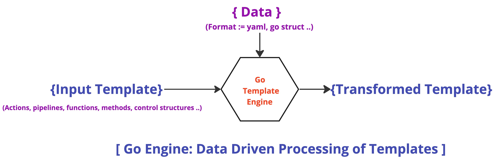

## Overview

[[_TOC_]]


## Introduction ::
Go's template designe to be **extended** and provides access to **data objects** and **additional functions** that are **passed** into the template engine **programmatically**.




## A tour of basic Go template ::

```script

This is a simple template

It can {{ "output" }} something.
It also
{{- " demonstrates" }} trim markers.
{{/* it has a comment */}}
It can {{ "output" }} something.
It can demonstrate {{ "output" | print }} using pipelines.
It also {{ $A := "assigns variables" }}{{ $A }}.
And conditionals:
{{ $B := 2 }}{{ if eq $B 1 }}B is 1{{ else }}B is 2{{ end }}
```

### Basic terminology ::

#### Template
It is the **entire text** that is submitted to the **template engine** to be rendered. The template consists of **text** and **actions**.
All text **outside** of actions is copied to the output **unchanged**.

### Actions

Actions provide the dynamic components of the template. They are delimited using {{ }}, as illustrated bellow :

```script
{{ "output" }}
{{- " demonstrates" }}
{{/* it has a comment */}}
{{ "output" | print }}
{{ $A := "assigns variables" }}{{ $A }}.
{{ $B := 2 }}{{ if eq $B 1 }}{{ else }}{{ end }}
```

Actions are **composed** of **control structure** or **data evaluation** through **pipelines**.

### Delimiters

Actions are set between a left delimiter **{{ by default** and  a right delimiter **}} by default**. The implementation can use **[[** and **]]** alternatively.

### Trim markers
Go template outputs everything between actions, including whitespace and line feeds. This can make it challenging to read **nested** template code.
If an actions’s left delimiter is followed immediately by a minus sign and ASCII space character **{{-**, all trailing white space is trimmed from the immediately preceding text. Likewise, if the right delimiter is preceded by a space and minus sign **-}}**, all leading white space id trimmed from the immediately following text.
Note, the ASCII space must be present in these trim markers.

### Comments
Comments are a special action created using a **/*** immediately following the left delimiter and a ***/** immediately preceding the right delimiter.

```script
{{/* it has a comment */}}
```

Comments can span multiple lines.

Note, comment out sections of a template while you are debugging it to simplify troubleshooting.

### Pipelines
A pipeline is one or more **commands chained together** using the pipe **|** symbol.

A command is a;
- simple value (argument)
- function or method call, possibly with multiple arguments.

Ex- 
```script
It can demonstrate {{ "output" | print }} using pipelines.
```

This template line uses pipelining to send the string literal output to the print function.

#### Simple values
Simple values are typically used as either the sole element in an action, like a string literal

```script
{{ "output" }}
```
which is rendered to the template in place. Simple values can also be referenced to data provided as context to the template. The context is represented by a period **.**, called dot.

#### Literals
Go templates support following types of literals;
- string  
	example : output
	note : may not contain unescaped line feeds.
- raw string
    example : `" out
    put"`
- integer
    example :: 42
- floating point
    example :: 72.04
- boolean
    example :: true, false
#### Function calls
Go templates provides a very limited of functions universally, and instead relies on the specifics implementation to add functions to enhance the user experience. 

```
{{ "output" | print }}
```

#### Method calls

Since Go template provides an empty context to the templates by default, there are no methods to be called.

### Control Structure

Control structures, used for providing **branching**, **iteration**, and **sub-templates**. 
The [doc](https://pkg.go.dev/text/template) of control structure uses T0 and T1 as **placeholders** for the specific template content that would be contained there. T0 and T1 might see a different version of dot depending on the control structure that is generating them. For example, ```with``` and ```range``` redefines dot to a new scope when their pipeline is non-empty.

List of Control Structures ::

**if**  

```script
{{if pipeline}} T1 {{end}}
```
If the value of the pipeline is empty, no output is generated; otherwise, T1 is executed. The empty values are false, 0, any nil pointer or interface value, and any array, slice, map, or string or length zero. Dot is unaffected.

```script
{{ if pipeline }} T1 {{ else }} T0 {{ end }}
```

If the value of the pipeline is empty, T0 is executed; otherwise T1 is executed. Dot is unaffected.

```script
{ {if pipeline }} T1 {{ else if pipeline }} T0 {{ end }}
```

To simplify the appearance of if-else chains, the else action of any if may include another if directly; the effect is same;

```script
{{ if pipeline }} T1 {{ else }} {{ if pipeline }} T0 {{ end }}{{ end }}
```

Following is a example of a template that uses ***if*** and the ***eq*** function to branch between outputs,

```script
{{ if eq $B 1 }} B is 1 {{ else }} B is not 1 {{end}}
````

**range**  

```script
{{range pipeline}} T1 {{end}}
```

The value of the pipeline must be an iterable (array/slice/map/channel). If the value of the pipeline has length zero, do is unaffected and T0 is executed; otherwise, dot is set to successive elements of the iterable. 

**with**

```script
{{with pipeline}} T1 {{else}} T0 {{end}}
```

If the value of the pipeline is empty, dot is unaffected and T0 is executed; otherwise, do is set to the value of the pipeline and T1 is executed.

**define**

```script
{{define "name"}} T1 {{end}}
```

Create template with the specified name that can be invoked using a ***template*** control structure.

**template**

```script
{{template ""name""}}
```

The template with the specified name is executed with nil data.

```script
{{template ""name"" pipeline}}
```

The template with the specified name is executed with dot set to the value of the pipeline.

**block**

```script
{{block "name" pipeline}} T1 {{end}}
```

A block is shorthand for defining a template.

```script
{{define "name"}} T1 {{end}}
```

and then executing it in place,
```script
{{template "name" pipeline}}
```

The typical use is to define a set of root templates that are then customized by redefining the block template within.

### Function List

Go template provides the following funtions,

#### Functions

**and**

Returns the boolean AND of its arguments by returning the first empty argument or the last argument, that is "and x y" behaves as "if x then y else x".

**call**

Returns the result of calling the first argument, which must be a function, with the remaining arguments as parameters. Thus "call.X.Y 1 2" is, in Go notation, dot.X.Y(1,2) where Y is a func-valued field, map entry, or the like.

**index**  
Returns the results of indexing its first argument by the following arguments. Thus ***index x 1 2 3*** is, in Go syntax, x[1][2][3]. Each indexed item must be a map, slice, or array.

**slice**
Slice returns the result of slicing it first argument by the remaining arguments Thus, slice x 1 2 is, Go syntax x[1:2]

**len**
Returns the integer length of its argument

**not**
Returns the boolean negation of its single argument.

**or**
Returns the boolean OR of its arguments by returning the first non-empty argument or the last argument, that is, "or x u" behaves as "if x then x else y

**print**
Same as Go syntax, fmt.Sprint

**printf**
Same as Go syntax, fat.Sprintf

**println**
Same as Go syntax, fmt.Sprintln

#### Comparaison Functions
**eq** : Returns the boolean truth of arg1 == arg2
**ne** : Returns the boolean truth of arg1 != arg2
**lt** : Returns the boolean truth of arg1 < arg2
**le** : Returns the boolean truth of arg1 <= arg2
**gt** : Returns the boolean truth of arg1 < arg2
**ge** : Returns the boolean truth of arg1 >= arg2

#### Specialized Output Functions

**html**
Returns the escaped HTML equivalent of the textual representation of its arguments.
**js**
Returns the escaped JavaScript equivalent of the textual representation of its arguments.
**urlquery**  
Returns the escaped value of the textual representation of its arguments in a form suitable for embedding in a URL query.


References ::
[Go Template tuto HashiCorp](https://developer.hashicorp.com/nomad/tutorials/templates/go-template-syntax)


