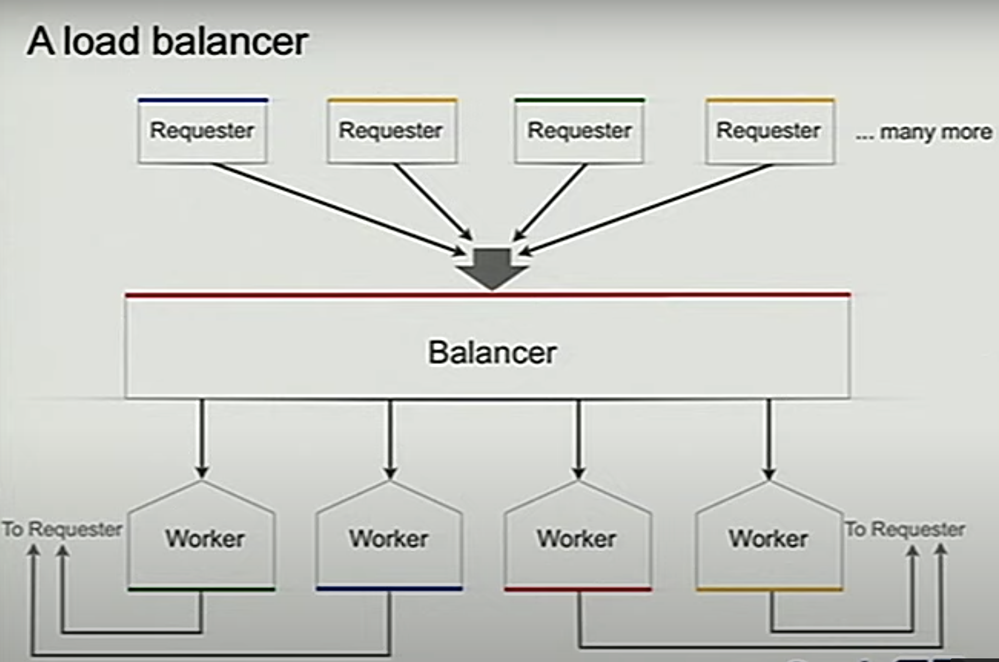

# Thinking in Go

Go is different !!

Programming in GO is different from programming in most procedural languages.
"If you try to write Java* programs in Go, you may become frustrated. If you write Go programs in GO, you will be more productive"

Go is and Go is not ::
<> Go is object-oriented not type-oriented
- inheritance is not primary (no class and subclass etc). Inheriteance is not the only way to structure a program.
- methods on type, but not classes or sub-classes
<> Go is mostly implicit not explicit
- types are inferred not declared
- go is stically typed (compiler must be able to determine the type ! )
- objects have interfaces but they are **derived**, not specified
<> Go is concurrent not parallel ( is Scala faire on this point ? )
- intended for program structure, not maximum performance !!
- but still can keep all the cores humming nicely
- ... and some programs are nicer even if not parallel at all

A specification of behavior ::

The ***expression evaluators**, like in java, often define a type, called Value, as a parent class with integers, strings its as child classes (constructor chaining !)

But in Go, we just specify what a Value **needs to do**.  
For our simple example, that means : do binary operations and be printable:

```
type Value interface {
BinaryOp(op string, y Value) Value
String() string
}
``` 

Implement those methods and you have a type that the evaluator can use.
Integer Values

Dead easy; just write the methods. (No extra bookkeeping !!)

```
Type Int int  // A basic type
Func (x Int) String() string { return strconv.Itoa(int(x)) }
Func (x Int) BinaryOp(op string, y Value) Value {
	switch y := y.(type) {
	case Int:
	  switch op {
	  case "+": return x + y
	  case "-": return x -y
	  case "*": return x * y
	      ....

        }
        case Error:
            return y
        }
	return Error(fmt,Sprintf("illegal op: '%v %s %v'",x,op,y))
 
```

Errors

For error handling, define an Error type that satisfies Value that will just propagate the error up the evaluation tree.

```
Type Error string
Func (e Error) String() string {
	return string(e)
}
Func (e Error) BinaryOp(op string, y Value) Value {
	return e
}

```
No need for **implements** clause or other annotations.   No retroactive book keeping !!
Ints and Errors are Values because they satisfy the Value interface **implicitly**. 

No inheritance in go ::

Objects but no hierarchy :

In Java, the **type hierarchy** is the foundation of the program, which can be hard to change as the design evolves.
(Can be easier to compromise the design than change the foundation.)

Programming in Go is not primarily about types and inheritance. There is **no type hierarchy**. The most important design decisions **don't have to be made first**, and it's **easy to change** types as the program develops because the compiler infers relationships **automatically**. 

Go programs are therefore more **flexible and adaptable**.

Interfaces in go ar **implicit**, meaning flexible :

<> In Go, could use as many wrappers as you like.
- A type can satisfy many interfaces and therefore be used by any number of **abstract wrappers**.
<> In Java, can only extend one abstract class.
- Could use Java interfaces but still need to annotate the original implementation - that is, edit the existing code.
<> In Go, interface in go are **lightweight** :
<> A typical Go interface has only one or two methods
- In fact, the commonest interface has zero method !
<> Programmers new to Go see interfaces as a building block for type hierarchy and tend to create interfaces with many methods.
<> But **that's the wrong way** to think about them. Interfaces in Go meant to be :
- small
- nimble
- often ad hoc

Example : TBD 
1. Zlib Compressor
2. JSON rpc

## Concurrency in go

Java programmers use class hierarchies to structure their program.
Go's concurrency primitives provide the elements of another approach.

Go's focus is on **concurrency**.

Conncurrency is not about parallelism. Concurrent programming allows parallelism but that's not what it's really for.
It's about **expressing program structure** to represent **independently executing actions**.

In shot :
- parallelism is **about performance**
- concurrency is about **program design**

Example : Load balancer (LB)

Imagine you have many processes requesting actions and a few workers that share the load. Assume workers are more efficient if they batch many requests.

We want a load balancer that distributes the load fairly across the workers according to their current workload.

In real life we'd distribute work across many machines, but for simplicity we'll just focus on a a local load balancer.
This is simplistic but representative of the core of a realistic problem.



Life of a request

Requesters make a request to the load balancer.
Load balancer immediately sends the request to the most lightly loaded worker.
When it completes the task the worker replies directly to the requester. Balancer adjusts its measure of the workloads.

Requester

// The requester sends Requests to LB.

```
Type Request struct {
	fn func() int // The operation to perform
        c chan int    // 

}

Func requester (work chan Request) {
	c:= make(chan int)
	for {
	    time.Sleep(rand.Int63n(nWorker * 2e9)) // spend time
	    work <- Request{workFn, c}   // send request
	    result := <-c    // wait for answer
            furtherProcess(result)

	}

}

```

Worker

// The LB will send request to the most lightly loaded worker.

```
Func (w *Worker) work(done chan *Worker) {
	for {
	    req := <-w.requests  // get Request from load balancer
            req.c <- req.fn()    //call fn and send result to requester
            done  <- w           // tell balancer we've finished this job

```

The channel of requests (w.requests) delivers requests to each worker.
The LB tracks the number of pending requests as a measure of load.

Note that each response goes **directly** to its requester.    

Balancer

The LB needs **a pool of workers** and **a single channel** to which requester can send work.

```
Type Pool []*Worker
Type Balancer struct {
	pool pool
	done chan *Worker
}

// A simple balancer

fun (b *Balancer) balance(work chan Request) {
	for {
	  select {
          case req := <-work:   // received a Request ...
               b.dispatch(req)  //... so send it to a Worker
          case w := <-b.done:   // a worker has finished a request ....
               b.completed(w)   // ... so update its info
            }   
          }
}

```

A heap of channels

How do we implement **dispatch** and **completed** ?

We can use a heap to choose the most lightly loaded worker by attaching the necessary methods to type Pool (Len, Push, Pop, Swap, Less).
That's easy; here for instance is Less:

```
func (p Pool) Less(i,j int) bool {
	return p[i].pending < p[j].pending
	}

```
And in each Worker, we keep a count of pending operations.

```
type Worker struct {
	requests chan Request    // work to do (a buffered channel)
	pending  int             // count of pending tasks
	index    int             // index in the heap
}
```

Use the heap to maintain balance,

```

// send request to worker
fun (b *Balancer) dispatch(req Request) {
	w := heap.Pop(&b.pool).(*Worker)   // least loaded worker ...
	w.request <- req                   // ... is assigned the task
	w.pending++                       // one more in its queue
	heap.Push(&b.pool, w)             // pub it back in the heap
}

// Job is completed; update heap
func (b *Balancer) completed(w *Worker) {
	w.pending--                       // one fewer in is queue
	heap.Remove(&b.pool, w.index)     // remove it from heap
	heap.Push(&b.pool, w)             // put it back where it belongs    

}

```

Channels are **first-class** values. We've built a heap of channels to multiplex and load balance.

The key points of the LB example;
Every operations blocks, yet this system is highly concurrent. The combinaton of **communication and synchronization** is a powerful tool.

{Closure,channel} pairs are a **nice way** to pass work around. The closure says what to do; the channel lets the answer flow directly back to the requester.

Channels can be part of other data structures and can be passed between goroutines.

With very little work, we could use network channels or RPCs to make this a distributed, networked LB. (Although closures don't work across the network, RPC help.)

### Go is more productive as :
- any type can be given methods, which opens up interesting desing possibilities.
- most of the bookkeeping of type-driven programming is done automatically.
- the structuring power of concurrent programming leads easily to correct, scalable server softwre.

Such properties make Go programs more malleable, more adaptable, less brittle.


FAQ ::


How to managed shared state (imposing memory barrier) while writing concurrent program in go ?

Using channel, the combination of **communication & synchronization**, is much more powerful than old way of doing concurrent programming using shared variable and protect them using mutex.

How stack works in go ?
The stack in go grows dynamically. No fixed size.

Is there a global namespace in go ?
No. Every name is relative to a package.

What is defer ?
Right before returning the functiona call, execute something. It is a dynamic call (meaning not scoped).


